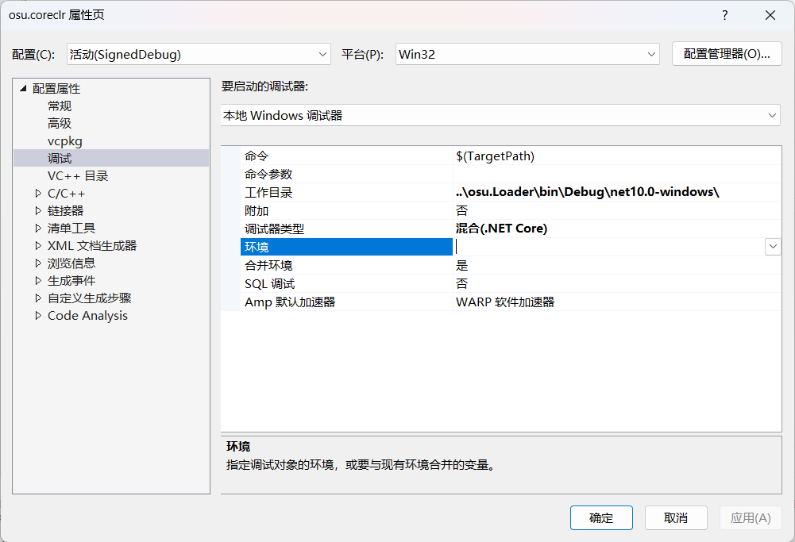

# DotNetHosting 项目 - .NET 运行时自定义承载示例

这是一个演示如何**自定义承载 .NET 运行时**的示例项目集。通过替换或扩展标准的.NET宿主，可以实现诸如版本控制、自定义程序集加载、进程注入、应用程序兼容性修补等高级场景。

## 项目结构概述

- `HostingSdk/` - **核心依赖**：包含准备特定版本 .NET Hosting SDK 的说明。
- `osu.coreclr/` - **具体应用示例**：演示如何将 .NET CoreCLR 宿主化以运行特定游戏客户端。
- `osu.Loader/` - 配套的加载器与兼容性层。

> **⚠️ 核心要求**：成功运行任何示例前，**必须**完成以下准备工作中的 **1、2、3** 步。

## 准备工作（所有示例通用）

### 1. 获取源码与基础环境
- [ ] **克隆仓库**到本地。
- [ ] 安装 **[.NET 10 SDK (x86版本)](https://dotnet.microsoft.com/download/dotnet/10.0)**。
- [ ] 安装 **Visual Studio 2026（社区版即可）**。在安装器中务必勾选以下工作负载：
    - `.NET 桌面开发`
    - `使用C++的桌面开发`

### 2. 准备代码签名证书
**签名是强制要求，而非可选步骤。** 目标应用程序（如游戏客户端）会验证**其所在进程的主模块**（即 `osu.coreclr.exe`）的代码签名有效性。未经签名的模块将导致目标程序抛出异常并拒绝运行。

**你有两个选择：**
- **A. 使用已有的可信证书**：如果你已有受本机信任的代码签名证书（如来自企业CA或购买的个人证书），可跳过下面的自签步骤。
- **B. 创建自签名证书（推荐用于本地测试）**：
    1.  **创建证书**：使用PowerShell创建一个用于代码签名的自签证书。
        ```powershell
        # 打开 PowerShell（管理员权限）
        New-SelfSignedCertificate -CertStoreLocation Cert:\CurrentUser\My -Subject "CN=DotNetHosting-Local" -KeyExportPolicy Exportable -Type CodeSigningCert
        ```
        > 提示：可使用DeepSeek等AI助手生成更详细的证书创建命令。
    2.  **导入到受信任的根目录**：将创建的证书从“当前用户 -> 个人”存储区，**导入**到“受信任的根证书颁发机构”存储区（使用 `certmgr.msc`）。
    3.  **重启计算机**：此步骤**必须**执行，以使系统完全信任新证书。

> **📌 关于自签证书的重要说明**
> - 此证书**仅在你的计算机上有效**。其他用户要运行你签名的程序，也必须导入此证书。
> - **签名原因**：客户端验证的是进程主模块（`osu.coreclr.exe`）的签名，**未签名的主模块将导致验证失败**。

### 3. 获取 .NET Hosting SDK
这是项目运行的核心依赖，**版本必须完全匹配**。
1.  进入项目下的 `HostingSdk/` 文件夹。
2.  仔细阅读并遵循其中的 `README.md` 文件说明。
3.  准备 **.NET 10.0.0 x86 版本**的 Hosting SDK。
    > **🚨 警告：SDK版本必须为 `10.0.0 x86`，差一点都不行！**

## 示例：osu.coreclr - 游戏客户端承载

此示例演示如何通过自定义的 .NET CoreCLR 宿主来运行 **osu!** 游戏客户端，特别展示了如何处理需要代码签名的真实世界场景。

### 示例概述与技术原理
- **目标**：使原生为 .NET Framework 编写的 osu! 客户端运行在 **.NET 10 运行时**上。
- **签名必要性**：osu! 客户端会验证**其所在进程的主模块**的代码签名。由于整个进程由 `osu.coreclr.exe` 启动，**该主模块必须被有效签名**，否则客户端将拒绝运行。
- **核心加载原理（进程内连续加载）**：
    1. **`osu.coreclr.exe`（原生C++）** 作为进程主模块启动，通过 `hostfxr` **在同一进程内**初始化 **.NET CoreCLR 运行时**。
    2. 运行时初始化后，加载 `osu.Loader` 托管程序集。
    3. 调用 `osu.Loader` 中唯一的**非托管导出函数** `Loader.LoadAndExecute()`。
    4. 该函数继续**在同一进程内**加载并执行原版 osu! 客户端的程序集。

> **⚠️ 此示例当前状态**
> - **不支持官方联网**：加载器默认会注入禁止联网的参数。
> - **可能支持第三方服务器**：部分私服（如 `osu.ppy.sb`）可能允许此类客户端，需手动修改加载器代码。
> - **不稳定**：为概念验证，可能存在崩溃。

### 编译与运行步骤

#### 1. 编译项目
1.  使用 Visual Studio 2026 打开项目根目录的 `DotNetHosting.sln`。
2.  选择 **`Debug | x86`** 作为解决方案配置。
    > *提示：`Release | x86` 会损失加载器的可调试性。*
3.  将 **`osu.coreclr`** 项目设为启动项目。
4.  在 `osu.coreclr` 项目属性的“调试”选项卡中，将“工作目录”设置为：
    ```
    ..\osu.Loader\bin\Debug\net10.0-windows\
    ```
    
5.  按下 **`Ctrl+Shift+B`** 编译解决方案。

#### 2. 签名主模块（关键步骤）
**必须对作为进程主模块的 `osu.coreclr.exe` 进行有效代码签名，这是客户端验证通过的前提。**
1.  打开 **Developer PowerShell for VS 2026**。
2.  切换到 `osu.Loader` 的输出目录：
    ```powershell
    cd "你的项目绝对路径\DotNetHosting\osu.Loader\bin\Debug\net10.0-windows"
    ```
3.  **查找你的证书名称**：
    ```powershell
    Get-ChildItem Cert:\CurrentUser\My -CodeSigningCert | Select-Object Subject
    ```
4.  **使用 `signtool` 签名主模块**：
    ```powershell
    signtool sign /n "你的证书名称" /fd SHA512 .\osu.coreclr.exe
    ```
    > **注意**：将 `"你的证书名称"` 替换为实际的证书名称（CN）。必须使用**英文双引号**。

#### 3. 启动游戏
- **方式一（正常启动）**：在 VS 中直接启动 `osu.coreclr` 项目（按 F5），将看到 osu! 更新窗口。
- **方式二（跳过更新）**：
    1.  将原版 `osu!.exe` 及其依赖 DLL（**排除 `osu!auth.dll` 反作弊模块**）复制到 `osu.Loader` 输出目录。
    2.  再次运行 `osu.coreclr` 项目，应直接进入游戏主界面。

> **💡 提示**：启动前建议将 Visual Studio 窗口移到另一个虚拟桌面，避免游戏全屏覆盖调试器。

### 高级配置
- **启用联网**：修改 `osu.Loader` 项目中的 `Loader.cs`，移除禁止联网的代码，**仅需重新编译 `osu.Loader`，无需重新签名 `osu.coreclr.exe`**。
- **已知问题**：可能触发特定 AMD 显卡驱动的 `Access Violation` 异常，属于原生兼容性问题。

## 其他用例（自行扩展）

您可以参考 `osu.coreclr` 示例的结构，创建自己的自定义承载项目，例如：
- 为旧版 .NET Framework 应用提供现代化运行时环境。
- 实现应用程序的插件隔离与热重载机制。
- 构建自定义的调试与分析工具链。

## 贡献
如果您有新的承载用例想法或改进建议，欢迎提交 Issue 和 Pull Request 进行探讨。
